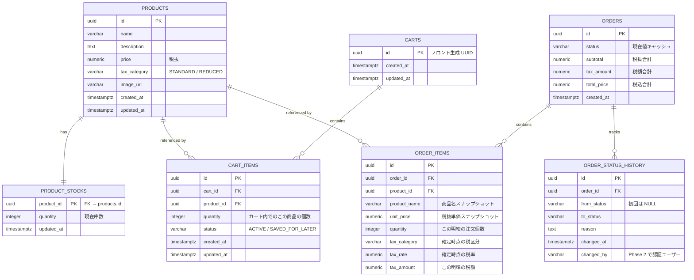

# 01. データベース詳細設計

要件定義書 v0.4 §8「データモデル」に対応する物理設計。Phase 1 スコープ。
v0.5 改版に伴う追加(「あとで買う」・税区分・状態遷移履歴・在庫分離)を含む。

---

## 1. 設計方針

| 項目 | 決定 | 備考 |
|------|------|------|
| RDBMS | PostgreSQL 16 | 要件書 §11 |
| ORM | Spring Data JPA (Hibernate) | 要件書 §11 |
| Entity 位置づけ | **Entity = ドメインモデル**(同一クラス) | Phase 1 方針 |
| 主キー | UUID (アプリ側生成 = `UUID.randomUUID()`) | cartId がフロント生成の方針と整合 |
| 命名規則 | DB: `snake_case` / Java: `camelCase` | Hibernate の `SpringPhysicalNamingStrategy` に委譲 |
| タイムゾーン | `timestamptz`(UTC 保存) | Java 側は `OffsetDateTime` |
| 金額型 | `NUMERIC(12, 2)` ↔ `BigDecimal` | 小数第2位まで |
| 税率型 | `NUMERIC(5, 4)` ↔ `BigDecimal` | `0.0800` = 8% |
| 価格保持方式 | **税抜** (`products.price`) | 税込は表示時に計算し併記 |
| 論理削除 | 採用しない(物理削除のみ) | Phase 2 で再検討 |
| マイグレーション | **Flyway** | `ddl-auto=validate` に固定 |

---

## 2. ER 図



---

## 3. テーブル定義

### 3.1 `products`

商品マスタ。価格・税区分・画像 URL などの**変更頻度の低い情報**のみを持つ。在庫は `product_stocks` に分離。

| カラム | 型 | NULL | デフォルト | 制約・説明 |
|--------|-----|------|-----------|------------|
| `id` | `UUID` | NO | — | PK |
| `name` | `VARCHAR(255)` | NO | — | 商品名。`@NotBlank` |
| `description` | `TEXT` | YES | `NULL` | 商品説明 |
| `price` | `NUMERIC(12, 2)` | NO | — | **税抜価格**。`CHECK (price > 0)` |
| `tax_category` | `VARCHAR(16)` | NO | `'STANDARD'` | `CHECK (tax_category IN ('STANDARD','REDUCED'))` |
| `image_url` | `VARCHAR(2048)` | YES | `NULL` | 画像 URL(ファイル本体アップロードは Phase 2) |
| `created_at` | `TIMESTAMPTZ` | NO | `now()` | — |
| `updated_at` | `TIMESTAMPTZ` | NO | `now()` | `@PreUpdate` で更新 |

### 3.2 `product_stocks`

在庫数を商品から分離したテーブル。**products と 1対1**(`product_id` が PK 兼 FK)。

| カラム | 型 | NULL | デフォルト | 制約・説明 |
|--------|-----|------|-----------|------------|
| `product_id` | `UUID` | NO | — | PK & FK → `products(id)` `ON DELETE CASCADE` |
| `quantity` | `INTEGER` | NO | `0` | `CHECK (quantity >= 0)` |
| `updated_at` | `TIMESTAMPTZ` | NO | `now()` | 在庫変更時刻 |

**分離の理由**:
- 変更頻度・責務が products と異なる(マスタ vs 在庫変動)
- Phase 2 で `@Version` を付けた楽観ロックをこのテーブルに限定できる(ロック粒度最小化)
- Phase 2 で `stock_movements`(入出庫履歴)を追加する際の自然な拡張経路

**運用ルール**: 商品登録時は同一トランザクションで `product_stocks` の行も作成する(初期値は登録 API の `stock`)。

### 3.3 `carts`

カートのメタデータ。`id` はフロントが `crypto.randomUUID()` で生成した値をそのまま採用。Service 層で upsert する。

| カラム | 型 | NULL | デフォルト | 制約・説明 |
|--------|-----|------|-----------|------------|
| `id` | `UUID` | NO | — | PK。フロント生成 UUID |
| `created_at` | `TIMESTAMPTZ` | NO | `now()` | — |
| `updated_at` | `TIMESTAMPTZ` | NO | `now()` | — |

### 3.4 `cart_items`

カート内の商品行。`PATCH /api/cart/items/{id}` ・`DELETE /api/cart/items/{id}` のパスパラメータはこの `id`。

| カラム | 型 | NULL | デフォルト | 制約・説明 |
|--------|-----|------|-----------|------------|
| `id` | `UUID` | NO | — | PK |
| `cart_id` | `UUID` | NO | — | FK → `carts(id)` `ON DELETE CASCADE` |
| `product_id` | `UUID` | NO | — | FK → `products(id)` `ON DELETE RESTRICT` |
| `quantity` | `INTEGER` | NO | — | **カート内でのこの商品の個数**。`CHECK (quantity >= 1)` |
| `status` | `VARCHAR(32)` | NO | `'ACTIVE'` | `CHECK (status IN ('ACTIVE','SAVED_FOR_LATER'))` |
| `created_at` | `TIMESTAMPTZ` | NO | `now()` | — |
| `updated_at` | `TIMESTAMPTZ` | NO | `now()` | — |

**一意制約**: `UNIQUE (cart_id, product_id, status)` — 同じ商品を「ACTIVE と SAVED_FOR_LATER に同時に1つずつ」は許容。同一ステータス内での重複は追加時に `quantity` をマージする。

**運用ルール**:
- 注文確定時は `status='ACTIVE'` の行のみを対象とする(`SAVED_FOR_LATER` は残す)
- `GET /api/cart` は status でグルーピングして返す(API 仕様は `02-api-spec.md` で規定)

### 3.5 `orders`

注文ヘッダー。`status` は現在値キャッシュ。真実の情報源は `order_status_history`。

| カラム | 型 | NULL | デフォルト | 制約・説明 |
|--------|-----|------|-----------|------------|
| `id` | `UUID` | NO | — | PK |
| `status` | `VARCHAR(16)` | NO | — | `CHECK (status IN ('PENDING','CONFIRMED','CANCELLED','REFUNDED'))` |
| `subtotal` | `NUMERIC(12, 2)` | NO | — | 税抜合計 = Σ(`unit_price` × `quantity`) |
| `tax_amount` | `NUMERIC(12, 2)` | NO | — | 税額合計 = Σ(`order_items.tax_amount`) |
| `total_price` | `NUMERIC(12, 2)` | NO | — | 税込合計 = `subtotal` + `tax_amount` |
| `created_at` | `TIMESTAMPTZ` | NO | `now()` | 注文作成日時。状態遷移の真実源は履歴テーブル |

Phase 1 で実使用する status は `CONFIRMED` のみ。他は Enum として定義のみ。

### 3.6 `order_items`

注文明細。**注文確定時点のスナップショット**として保持。

| カラム | 型 | NULL | デフォルト | 制約・説明 |
|--------|-----|------|-----------|------------|
| `id` | `UUID` | NO | — | PK |
| `order_id` | `UUID` | NO | — | FK → `orders(id)` `ON DELETE CASCADE` |
| `product_id` | `UUID` | NO | — | FK → `products(id)` `ON DELETE RESTRICT` |
| `product_name` | `VARCHAR(255)` | NO | — | 商品名スナップショット |
| `unit_price` | `NUMERIC(12, 2)` | NO | — | **税抜**単価スナップショット |
| `quantity` | `INTEGER` | NO | — | **この明細で注文した個数**。`CHECK (quantity >= 1)` |
| `tax_category` | `VARCHAR(16)` | NO | — | 確定時点の税区分(`STANDARD` / `REDUCED`) |
| `tax_rate` | `NUMERIC(5, 4)` | NO | — | 確定時点の税率(例 `0.0800`) |
| `tax_amount` | `NUMERIC(12, 2)` | NO | — | この明細の税額 = `unit_price` × `quantity` × `tax_rate`(端数処理は後述) |

**一意制約**: `UNIQUE (order_id, product_id)` — 同一注文内で同商品は1行にまとめる。

**税額端数処理**: **行単位で切り捨て**(消費税法の一般的運用に合わせる)。Service 層で `setScale(0, RoundingMode.DOWN)` 相当を行う。円未満を保持したい場合は Phase 2 で再検討。

### 3.7 `order_status_history`

注文の状態遷移履歴。監査ログ兼、キャンセル・返金時の払い戻し計算の根拠となる。

| カラム | 型 | NULL | デフォルト | 制約・説明 |
|--------|-----|------|-----------|------------|
| `id` | `UUID` | NO | — | PK |
| `order_id` | `UUID` | NO | — | FK → `orders(id)` `ON DELETE CASCADE` |
| `from_status` | `VARCHAR(16)` | YES | `NULL` | 初回遷移時は `NULL` |
| `to_status` | `VARCHAR(16)` | NO | — | Enum 準拠 |
| `reason` | `TEXT` | YES | `NULL` | "顧客都合キャンセル" 等 |
| `changed_at` | `TIMESTAMPTZ` | NO | `now()` | — |
| `changed_by` | `VARCHAR(64)` | YES | `NULL` | Phase 2 認証導入時に埋める |

**許容する遷移**(Service 層で検証):

```
(null) → CONFIRMED                  -- Phase 1 で唯一発生する遷移
(null) → PENDING → CONFIRMED        -- Phase 2 (決済連携)
CONFIRMED → CANCELLED → REFUNDED    -- Phase 2 (キャンセル→返金)
```

**運用ルール**: `orders.status` を変更する Service は、**同一トランザクションで履歴行を1件 INSERT** する。これを破ると真実源が壊れるため、基盤クラスまたはドメインイベントで強制する(詳細は `05-domain-order.md`)。

---

## 4. インデックス戦略

| テーブル | インデックス | 目的 |
|----------|--------------|------|
| `products` | `idx_products_name` (`name`) | 商品一覧の `sort=name` 対応 |
| `cart_items` | `idx_cart_items_cart_id_status` (`cart_id`, `status`) | カート取得時の絞り込み(status 別) |
| `order_items` | `idx_order_items_order_id` (`order_id`) | 注文詳細の絞り込み |
| `orders` | `idx_orders_created_at` (`created_at DESC`) | 注文履歴表示(Phase 2 想定) |
| `order_status_history` | `idx_osh_order_id_changed_at` (`order_id`, `changed_at DESC`) | 最新状態取得・履歴表示 |

---

## 5. スナップショット方針

要件書 §8 の「注文確定時点の金額スナップショット」を物理設計レベルで担保する。

| 対象 | 位置 | 理由 |
|------|------|------|
| 単価(税抜) | `order_items.unit_price` | 要件書明記 |
| 商品名 | `order_items.product_name` | Phase 2 の商品削除・改名に耐える |
| 税区分 | `order_items.tax_category` | 商品の税区分が将来変わっても過去注文を正確に再計算 |
| 税率 | `order_items.tax_rate` | **税率改定を跨ぐキャンセル時に払い戻し額を固定化** |
| 税額 | `order_items.tax_amount` | 行単位の端数処理結果を保持(再計算不要化) |
| 小計・税額・総額 | `orders.subtotal` / `tax_amount` / `total_price` | 注文全体の金額を確定時点で固定 |

商品画像 URL はスナップショットしない(Phase 2 で画像アップロード機能が入った際に再検討)。

---

## 6. カート upsert の方針

フロントは localStorage 生成 UUID を `X-Cart-Id` ヘッダーで送る。サーバー処理順:

1. `carts` に該当 `id` が存在しなければ `INSERT`
2. 以降 `cart_items` を操作

JPA では `CartRepository.findById` → 無ければ `save(new Cart(headerId))`。Phase 1 は ON CONFLICT を使わず Service 層分岐。

---

## 7. マイグレーション運用

- ツール: **Flyway**
- 配置: `backend/src/main/resources/db/migration/V{n}__{description}.sql`
- 初期 DDL: `V1__init.sql`
- `application.yml`: `spring.jpa.hibernate.ddl-auto: validate`
- `spring.jpa.show-sql` は開発時のみ `true`

---

## 8. 初期 DDL(`V1__init.sql` 案)

```sql
-- products
CREATE TABLE products (
    id            UUID PRIMARY KEY,
    name          VARCHAR(255) NOT NULL,
    description   TEXT,
    price         NUMERIC(12, 2) NOT NULL CHECK (price > 0),
    tax_category  VARCHAR(16) NOT NULL DEFAULT 'STANDARD'
                  CHECK (tax_category IN ('STANDARD', 'REDUCED')),
    image_url     VARCHAR(2048),
    created_at    TIMESTAMPTZ NOT NULL DEFAULT now(),
    updated_at    TIMESTAMPTZ NOT NULL DEFAULT now()
);
CREATE INDEX idx_products_name ON products (name);

-- product_stocks
CREATE TABLE product_stocks (
    product_id  UUID PRIMARY KEY
                REFERENCES products(id) ON DELETE CASCADE,
    quantity    INTEGER NOT NULL DEFAULT 0 CHECK (quantity >= 0),
    updated_at  TIMESTAMPTZ NOT NULL DEFAULT now()
);

-- carts
CREATE TABLE carts (
    id         UUID PRIMARY KEY,
    created_at TIMESTAMPTZ NOT NULL DEFAULT now(),
    updated_at TIMESTAMPTZ NOT NULL DEFAULT now()
);

-- cart_items
CREATE TABLE cart_items (
    id         UUID PRIMARY KEY,
    cart_id    UUID NOT NULL REFERENCES carts(id) ON DELETE CASCADE,
    product_id UUID NOT NULL REFERENCES products(id) ON DELETE RESTRICT,
    quantity   INTEGER NOT NULL CHECK (quantity >= 1),
    status     VARCHAR(32) NOT NULL DEFAULT 'ACTIVE'
               CHECK (status IN ('ACTIVE', 'SAVED_FOR_LATER')),
    created_at TIMESTAMPTZ NOT NULL DEFAULT now(),
    updated_at TIMESTAMPTZ NOT NULL DEFAULT now(),
    UNIQUE (cart_id, product_id, status)
);
CREATE INDEX idx_cart_items_cart_id_status ON cart_items (cart_id, status);

-- orders
CREATE TABLE orders (
    id          UUID PRIMARY KEY,
    status      VARCHAR(16) NOT NULL
                CHECK (status IN ('PENDING', 'CONFIRMED', 'CANCELLED', 'REFUNDED')),
    subtotal    NUMERIC(12, 2) NOT NULL,
    tax_amount  NUMERIC(12, 2) NOT NULL,
    total_price NUMERIC(12, 2) NOT NULL,
    created_at  TIMESTAMPTZ NOT NULL DEFAULT now()
);
CREATE INDEX idx_orders_created_at ON orders (created_at DESC);

-- order_items
CREATE TABLE order_items (
    id            UUID PRIMARY KEY,
    order_id      UUID NOT NULL REFERENCES orders(id) ON DELETE CASCADE,
    product_id    UUID NOT NULL REFERENCES products(id) ON DELETE RESTRICT,
    product_name  VARCHAR(255) NOT NULL,
    unit_price    NUMERIC(12, 2) NOT NULL,
    quantity      INTEGER NOT NULL CHECK (quantity >= 1),
    tax_category  VARCHAR(16) NOT NULL
                  CHECK (tax_category IN ('STANDARD', 'REDUCED')),
    tax_rate      NUMERIC(5, 4) NOT NULL,
    tax_amount    NUMERIC(12, 2) NOT NULL,
    UNIQUE (order_id, product_id)
);
CREATE INDEX idx_order_items_order_id ON order_items (order_id);

-- order_status_history
CREATE TABLE order_status_history (
    id           UUID PRIMARY KEY,
    order_id     UUID NOT NULL REFERENCES orders(id) ON DELETE CASCADE,
    from_status  VARCHAR(16),
    to_status    VARCHAR(16) NOT NULL
                 CHECK (to_status IN ('PENDING', 'CONFIRMED', 'CANCELLED', 'REFUNDED')),
    reason       TEXT,
    changed_at   TIMESTAMPTZ NOT NULL DEFAULT now(),
    changed_by   VARCHAR(64)
);
CREATE INDEX idx_osh_order_id_changed_at
    ON order_status_history (order_id, changed_at DESC);
```

---

## 9. 税率の管理(Phase 1 は定数扱い)

Phase 1 は `application.yml` で税率を定数化(要件書 v0.5.2 §4「税率の設定仕様」準拠):

```yaml
tax:
  rates:
    standard: "0.10"   # 標準税率 10%
    reduced:  "0.08"   # 軽減税率 8%
  rounding: FLOOR       # 行単位切り捨て
```

- 値は **YAML 上で文字列**(`"0.10"`)として記述する。素の数値は `double` 経由で丸め誤差を含みうるため。
- バインディングは `@ConfigurationProperties(prefix = "tax")` を付けた `record TaxProperties` で型安全に受ける。
- 参照は `TaxProperties#rateOf(TaxCategory) : BigDecimal` に集約し、Phase 2 のマスタ化(`tax_rates` テーブル)で呼び出し側を変えずに差し替えられるようにする。

注文確定時に `products.tax_category` に応じた税率を読み、`order_items.tax_rate` にスナップショット。

Phase 2 で税率改定に備えた `tax_rates` マスタを追加予定(期間管理 `effective_from` / `effective_to`)。その時点でも **order_items.tax_rate の役割(スナップショット)は不変**。

---

## 10. 未決事項 / Phase 2 以降

| # | 項目 | 現状 | Phase |
|---|------|------|-------|
| 1 | 放棄カートの TTL クリーンアップ | 無期限保持 | Phase 2 |
| 2 | UUID バージョン(v4 → v7 移行) | v4 | Phase 2 検討 |
| 3 | 楽観ロック(`@Version`) | 採用せず | Phase 2(`product_stocks` に付与) |
| 4 | 入出庫履歴 `stock_movements` | なし | Phase 2 |
| 5 | 税率マスタテーブル化 | 定数運用 | Phase 2 |
| 6 | CANCELLED 時の在庫戻し戦略 | 未定(全量戻す想定) | Phase 2 規定 |
| 7 | `orders.updated_at` 要否 | 履歴テーブルで代替するため不要 | — |
| 8 | 注文番号(人間可読) | UUID のみ | Phase 2 検討 |
| 9 | 税額端数処理(行単位切り捨て) | 暫定採用 | 事業要件次第で見直し |

---

## 11. 要件定義書との対応・要件書 v0.5 改版メモ

以下は要件書 v0.4 → v0.5 への追記が必要な項目。本設計書の根拠となる。

| 要件書 §(現行) | v0.5 で追記 | 本書 |
|-----------------|-------------|------|
| §3 機能要件 | 「あとで買う」機能(カート商品の ACTIVE / SAVED_FOR_LATER 切替) | §3.4 |
| §3 機能要件 | 注文のキャンセル・返金(Phase 2 実装だが設計上先取り) | §3.5, §3.7 |
| §8 Product | `stock` を `product_stocks` テーブルへ分離 / `tax_category` 追加 / `image_url` 追記 | §3.1, §3.2 |
| §8 Cart/CartItem | `status` フィールド追加 | §3.4 |
| §8 Order | `status` に `CANCELLED` / `REFUNDED` 追加 / `subtotal` / `tax_amount` 追加 | §3.5 |
| §8 OrderItem | `tax_category` / `tax_rate` / `tax_amount` 追加 | §3.6 |
| §8(新設) | 注文状態遷移履歴 `OrderStatusHistory` | §3.7 |
| §4 非機能 | 消費税対応(税抜保持・軽減税率・確定時点スナップショット) | §1, §5, §9 |
| §7 エラーレスポンス | 状態遷移違反(409)を追加予定 | — (`06-exception.md` で確定) |
