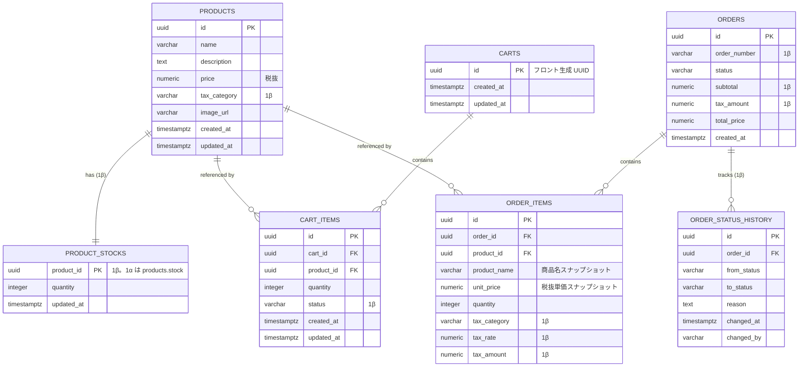

# 01. データベース詳細設計

要件定義書 v0.6 §8「データモデル」に対応する物理設計。Phase 1 スコープ。
Phase 1α(コア)/ Phase 1β(応用拡張)に分割し、マイグレーションを段階化する。

---

## 1. 設計方針

| 項目 | 決定 | 備考 |
|------|------|------|
| RDBMS | PostgreSQL 16 | 要件書 §11 |
| ORM | Spring Data JPA (Hibernate) | 要件書 §11 |
| Entity 位置づけ | **Entity = ドメインモデル**(同一クラス) | Phase 1 方針 |
| 主キー | UUID (アプリ側生成 = `UUID.randomUUID()`) | cartId がフロント生成の方針と整合 |
| 命名規則 | DB: `snake_case` / Java: `camelCase` | Hibernate の `SpringPhysicalNamingStrategy` に委譲 |
| タイムゾーン | `timestamptz`(UTC 保存) | Java 側は `OffsetDateTime` |
| 金額型 | `NUMERIC(12, 2)` ↔ `BigDecimal` | 小数第 2 位まで |
| 税率型 | `NUMERIC(5, 4)` ↔ `BigDecimal` | `0.0800` = 8%(1β 以降) |
| 価格保持方式 | **税抜** (`products.price`) | 税込は表示時に計算し併記(1β) |
| 論理削除 | 採用しない(物理削除のみ) | Phase 2 で再検討 |
| マイグレーション | **Flyway** | `ddl-auto=validate` に固定。段階的に `V1` → `V6` |

---

## 2. ER 図(Phase 1 完了時点 = 1α + 1β)



**凡例**: `"1β"` と注記したフィールド・テーブルは Phase 1β で追加される。

---

## 3. テーブル定義(最終形)

各カラムに **フェーズ** 列を追加し、1α で存在するか 1β で追加されるかを明示する。

### 3.1 `products`

商品マスタ。価格・税区分・画像 URL などの**変更頻度の低い情報**のみを持つ。在庫は 1β で `product_stocks` に分離。

| カラム | 型 | フェーズ | NULL | デフォルト | 制約・説明 |
|--------|-----|---------|------|-----------|------------|
| `id` | `UUID` | 1α | NO | — | PK |
| `name` | `VARCHAR(255)` | 1α | NO | — | 商品名。`@NotBlank` |
| `description` | `TEXT` | 1α | YES | `NULL` | 商品説明 |
| `price` | `NUMERIC(12, 2)` | 1α | NO | — | **税抜価格**。`CHECK (price > 0)` |
| `stock` | `INTEGER` | **1α のみ** | NO | `0` | `CHECK (stock >= 0)`。1β で削除し `product_stocks.quantity` に移管 |
| `tax_category` | `VARCHAR(16)` | 1β | NO | `'STANDARD'` | `CHECK (tax_category IN ('STANDARD','REDUCED'))` |
| `image_url` | `VARCHAR(2048)` | 1α | YES | `NULL` | 画像 URL(ファイル本体アップロードは Phase 2) |
| `created_at` | `TIMESTAMPTZ` | 1α | NO | `now()` | — |
| `updated_at` | `TIMESTAMPTZ` | 1α | NO | `now()` | `@PreUpdate` で更新 |

### 3.2 `product_stocks`(1β 新設)

在庫数を商品から分離したテーブル。**products と 1 対 1**(`product_id` が PK 兼 FK)。

| カラム | 型 | NULL | デフォルト | 制約・説明 |
|--------|-----|------|-----------|------------|
| `product_id` | `UUID` | NO | — | PK & FK → `products(id)` `ON DELETE CASCADE` |
| `quantity` | `INTEGER` | NO | `0` | `CHECK (quantity >= 0)` |
| `updated_at` | `TIMESTAMPTZ` | NO | `now()` | 在庫変更時刻 |

**分離の理由**:
- 変更頻度・責務が products と異なる(マスタ vs 在庫変動)
- Phase 2 で `@Version` を付けた楽観ロックをこのテーブルに限定できる(ロック粒度最小化)
- Phase 2 で `stock_movements`(入出庫履歴)を追加する際の自然な拡張経路

**運用ルール**: 商品登録時は同一トランザクションで `product_stocks` の行も作成する(初期値は登録 API の `stock`)。1α の時点では `products.stock` が同じ役割を果たす。

### 3.3 `carts`

カートのメタデータ。`id` はフロントが `crypto.randomUUID()` で生成した値をそのまま採用。Service 層で upsert する。

| カラム | 型 | フェーズ | NULL | デフォルト | 制約・説明 |
|--------|-----|---------|------|-----------|------------|
| `id` | `UUID` | 1α | NO | — | PK。フロント生成 UUID |
| `created_at` | `TIMESTAMPTZ` | 1α | NO | `now()` | — |
| `updated_at` | `TIMESTAMPTZ` | 1α | NO | `now()` | — |

### 3.4 `cart_items`

カート内の商品行。`PATCH /api/cart/items/{id}` ・`DELETE /api/cart/items/{id}` のパスパラメータはこの `id`。

| カラム | 型 | フェーズ | NULL | デフォルト | 制約・説明 |
|--------|-----|---------|------|-----------|------------|
| `id` | `UUID` | 1α | NO | — | PK |
| `cart_id` | `UUID` | 1α | NO | — | FK → `carts(id)` `ON DELETE CASCADE` |
| `product_id` | `UUID` | 1α | NO | — | FK → `products(id)` `ON DELETE RESTRICT` |
| `quantity` | `INTEGER` | 1α | NO | — | **カート内でのこの商品の個数**。`CHECK (quantity >= 1)` |
| `status` | `VARCHAR(32)` | 1β | NO | `'ACTIVE'` | `CHECK (status IN ('ACTIVE','SAVED_FOR_LATER'))` |
| `created_at` | `TIMESTAMPTZ` | 1α | NO | `now()` | — |
| `updated_at` | `TIMESTAMPTZ` | 1α | NO | `now()` | — |

**一意制約(1β から)**: `UNIQUE (cart_id, product_id, status)` — 同じ商品を「ACTIVE と SAVED_FOR_LATER に同時に 1 つずつ」は許容。同一ステータス内での重複は追加時に `quantity` をマージする。

> 1α では DB レベルの一意制約は張らない。**Service 層で `(cart_id, product_id)` をキーに既存行を検索して `quantity` を加算マージ**する([`04-domain-cart-product.md`](04-domain-cart-product.md) §3.2)。1β で `status` 列追加と同時に複合一意制約 `UNIQUE (cart_id, product_id, status)` を導入して物理的に担保する。

**運用ルール**:
- 1α は `ACTIVE` のみ。1β から `SAVED_FOR_LATER` が加わる
- 注文確定時は **`status='ACTIVE'` の行のみ** を対象とする(`SAVED_FOR_LATER` は残す)(1β)
- `GET /api/cart` は 1β から status でグルーピングして返す(API 仕様は [`02-api-spec.md`](02-api-spec.md) で規定)

### 3.5 `orders`

注文ヘッダー。`status` は現在値キャッシュ。真実の情報源は `order_status_history`(1β から)。

| カラム | 型 | フェーズ | NULL | デフォルト | 制約・説明 |
|--------|-----|---------|------|-----------|------------|
| `id` | `UUID` | 1α | NO | — | PK |
| `order_number` | `VARCHAR(16)` | 1β | NO | — | 表示用注文番号。`UNIQUE`。採番規則: `yyyyMMdd-NNNN`(JST 日次連番) |
| `status` | `VARCHAR(16)` | 1α | NO | — | 1α は `CHECK (status IN ('CONFIRMED'))`、1β で `('PENDING','CONFIRMED','CANCELLED','REFUNDED')` に拡張 |
| `subtotal` | `NUMERIC(12, 2)` | 1β | NO | — | 税抜合計 = Σ(`unit_price` × `quantity`) |
| `tax_amount` | `NUMERIC(12, 2)` | 1β | NO | — | 税額合計 = Σ(`order_items.tax_amount`) |
| `total_price` | `NUMERIC(12, 2)` | 1α | NO | — | 1α は単価 × 数量の合計、1β は `subtotal + tax_amount` |
| `created_at` | `TIMESTAMPTZ` | 1α | NO | `now()` | 注文作成日時。状態遷移の真実源は履歴テーブル(1β) |

Phase 1 で実使用する `status` は 1α・1β とも `CONFIRMED` のみ。他は 1β で Enum として定義のみ。

### 3.6 `order_items`

注文明細。**注文確定時点のスナップショット**として保持。

| カラム | 型 | フェーズ | NULL | デフォルト | 制約・説明 |
|--------|-----|---------|------|-----------|------------|
| `id` | `UUID` | 1α | NO | — | PK |
| `order_id` | `UUID` | 1α | NO | — | FK → `orders(id)` `ON DELETE CASCADE` |
| `product_id` | `UUID` | 1α | NO | — | FK → `products(id)` `ON DELETE RESTRICT` |
| `product_name` | `VARCHAR(255)` | 1α | NO | — | 商品名スナップショット |
| `unit_price` | `NUMERIC(12, 2)` | 1α | NO | — | 1α は単価スナップショット / 1β は **税抜** 単価 |
| `quantity` | `INTEGER` | 1α | NO | — | **この明細で注文した個数**。`CHECK (quantity >= 1)` |
| `tax_category` | `VARCHAR(16)` | 1β | NO | — | 確定時点の税区分(`STANDARD` / `REDUCED`) |
| `tax_rate` | `NUMERIC(5, 4)` | 1β | NO | — | 確定時点の税率(例 `0.0800`) |
| `tax_amount` | `NUMERIC(12, 2)` | 1β | NO | — | この明細の税額 = `unit_price` × `quantity` × `tax_rate`(端数処理は後述) |

**一意制約**: `UNIQUE (order_id, product_id)` — 同一注文内で同商品は 1 行にまとめる。

**税額端数処理(1β)**: **行単位で切り捨て**(消費税法の一般的運用に合わせる)。Service 層で `setScale(0, RoundingMode.FLOOR)` 相当を行う。円未満を保持したい場合は Phase 2 で再検討。

### 3.7 `order_status_history`(1β 新設)

注文の状態遷移履歴。監査ログ兼、キャンセル・返金時の払い戻し計算の根拠となる。

| カラム | 型 | NULL | デフォルト | 制約・説明 |
|--------|-----|------|-----------|------------|
| `id` | `UUID` | NO | — | PK |
| `order_id` | `UUID` | NO | — | FK → `orders(id)` `ON DELETE CASCADE` |
| `from_status` | `VARCHAR(16)` | YES | `NULL` | 初回遷移時は `NULL` |
| `to_status` | `VARCHAR(16)` | NO | — | Enum 準拠 |
| `reason` | `TEXT` | YES | `NULL` | "顧客都合キャンセル" 等 |
| `changed_at` | `TIMESTAMPTZ` | NO | `now()` | — |
| `changed_by` | `VARCHAR(64)` | YES | `NULL` | Phase 2 認証導入時に埋める |

**許容する遷移**(Service 層で検証):

```
(null) → CONFIRMED                  -- Phase 1β で唯一発生する遷移
(null) → PENDING → CONFIRMED        -- Phase 2(決済連携)
CONFIRMED → CANCELLED → REFUNDED    -- Phase 2(キャンセル → 返金)
```

**運用ルール**: `orders.status` を変更する Service は、**同一トランザクションで履歴行を 1 件 INSERT** する。これを破ると真実源が壊れるため、Aggregate メソッド方式で強制する(詳細は [`05-domain-order.md`](05-domain-order.md) §2.1)。

---

## 4. インデックス戦略

| テーブル | インデックス | フェーズ | 目的 |
|----------|--------------|---------|------|
| `products` | `idx_products_name` (`name`) | 1α | 商品一覧の `sort=name` 対応 |
| `cart_items` | `idx_cart_items_cart_id` (`cart_id`) | **1α のみ** | 1β で置き換え(`status` 列追加に伴う) |
| `cart_items` | `idx_cart_items_cart_id_status` (`cart_id`, `status`) | 1β | カート取得時の絞り込み(status 別) |
| `order_items` | `idx_order_items_order_id` (`order_id`) | 1α | 注文詳細の絞り込み |
| `orders` | `idx_orders_created_at` (`created_at DESC`) | 1α | 注文履歴表示(Phase 2 想定) |
| `order_status_history` | `idx_osh_order_id_changed_at` (`order_id`, `changed_at DESC`) | 1β | 最新状態取得・履歴表示 |

---

## 5. スナップショット方針

要件書 §8 の「注文確定時点の金額スナップショット」を物理設計レベルで担保する。

| 対象 | 位置 | フェーズ | 理由 |
|------|------|---------|------|
| 単価 | `order_items.unit_price` | 1α | 要件書明記(1α では税抜・税込の区別なし、1β で税抜に確定) |
| 商品名 | `order_items.product_name` | 1α | Phase 2 の商品削除・改名に耐える |
| 税区分 | `order_items.tax_category` | 1β | 商品の税区分が将来変わっても過去注文を正確に再計算 |
| 税率 | `order_items.tax_rate` | 1β | **税率改定を跨ぐキャンセル時に払い戻し額を固定化** |
| 税額 | `order_items.tax_amount` | 1β | 行単位の端数処理結果を保持(再計算不要化) |
| 小計・税額・総額 | `orders.subtotal` / `tax_amount` / `total_price` | 1β(subtotal/tax_amount)/ 1α(total_price) | 注文全体の金額を確定時点で固定 |

商品画像 URL はスナップショットしない(Phase 2 で画像アップロード機能が入った際に再検討)。

---

## 6. カート upsert の方針(1α から)

フロントは localStorage 生成 UUID を `X-Cart-Id` ヘッダーで送る。サーバー処理順:

1. `carts` に該当 `id` が存在しなければ `INSERT`
2. 以降 `cart_items` を操作

JPA では `CartRepository.findById` → 無ければ `save(new Cart(headerId))`。Phase 1 は ON CONFLICT を使わず Service 層分岐。並行実行で PK 競合した場合は「最後勝ち」方針に従い `DataIntegrityViolationException` をキャッチして再取得する(学習用の単一開発者環境では実質発生しない)。

---

## 7. マイグレーション運用

- ツール: **Flyway**
- 配置: `backend/src/main/resources/db/migration/V{n}__{description}.sql`
- `application.yml`: `spring.jpa.hibernate.ddl-auto: validate`
- `spring.jpa.show-sql` は開発時のみ `true`

### マイグレーション段階

| バージョン | フェーズ | 内容 |
|-----------|---------|------|
| `V1__init.sql` | 1α | 初期 DDL(products(stock inline) / carts / cart_items(no status) / orders(no order_number/tax) / order_items(no tax)) |
| `V2__split_product_stock.sql` | 1β | `product_stocks` 新設・`products.stock` からデータ移管・`products.stock` 削除 |
| `V3__add_tax.sql` | 1β | `products.tax_category` / `orders.subtotal` / `orders.tax_amount` / `order_items.{tax_category,tax_rate,tax_amount}` 追加 |
| `V4__order_status_history.sql` | 1β | `order_status_history` 新設・`orders.status` CHECK を拡張・既存注文のバックフィル |
| `V5__cart_item_status.sql` | 1β | `cart_items.status` 追加・インデックス張り替え・複合一意制約追加 |
| `V6__order_number.sql` | 1β | `orders.order_number` 追加・既存行をバックフィル・UNIQUE 制約追加 |

---

## 8. 初期 DDL(`V1__init.sql` — 1α 最小版)

```sql
-- products (1α: stock はインラインカラム)
CREATE TABLE products (
    id            UUID PRIMARY KEY,
    name          VARCHAR(255) NOT NULL,
    description   TEXT,
    price         NUMERIC(12, 2) NOT NULL CHECK (price > 0),
    stock         INTEGER NOT NULL DEFAULT 0 CHECK (stock >= 0),
    image_url     VARCHAR(2048),
    created_at    TIMESTAMPTZ NOT NULL DEFAULT now(),
    updated_at    TIMESTAMPTZ NOT NULL DEFAULT now()
);
CREATE INDEX idx_products_name ON products (name);

-- carts
CREATE TABLE carts (
    id         UUID PRIMARY KEY,
    created_at TIMESTAMPTZ NOT NULL DEFAULT now(),
    updated_at TIMESTAMPTZ NOT NULL DEFAULT now()
);

-- cart_items (1α: status なし)
CREATE TABLE cart_items (
    id         UUID PRIMARY KEY,
    cart_id    UUID NOT NULL REFERENCES carts(id) ON DELETE CASCADE,
    product_id UUID NOT NULL REFERENCES products(id) ON DELETE RESTRICT,
    quantity   INTEGER NOT NULL CHECK (quantity >= 1),
    created_at TIMESTAMPTZ NOT NULL DEFAULT now(),
    updated_at TIMESTAMPTZ NOT NULL DEFAULT now()
);
CREATE INDEX idx_cart_items_cart_id ON cart_items (cart_id);

-- orders (1α: CONFIRMED 固定、order_number・tax 関連なし)
CREATE TABLE orders (
    id           UUID PRIMARY KEY,
    status       VARCHAR(16) NOT NULL
                 CHECK (status IN ('CONFIRMED')),
    total_price  NUMERIC(12, 2) NOT NULL,
    created_at   TIMESTAMPTZ NOT NULL DEFAULT now()
);
CREATE INDEX idx_orders_created_at ON orders (created_at DESC);

-- order_items (1α: tax 関連なし)
CREATE TABLE order_items (
    id            UUID PRIMARY KEY,
    order_id      UUID NOT NULL REFERENCES orders(id) ON DELETE CASCADE,
    product_id    UUID NOT NULL REFERENCES products(id) ON DELETE RESTRICT,
    product_name  VARCHAR(255) NOT NULL,
    unit_price    NUMERIC(12, 2) NOT NULL,
    quantity      INTEGER NOT NULL CHECK (quantity >= 1),
    UNIQUE (order_id, product_id)
);
CREATE INDEX idx_order_items_order_id ON order_items (order_id);
```

## 8.2 `V2__split_product_stock.sql`(1β)

```sql
-- product_stocks 新設
CREATE TABLE product_stocks (
    product_id  UUID PRIMARY KEY
                REFERENCES products(id) ON DELETE CASCADE,
    quantity    INTEGER NOT NULL DEFAULT 0 CHECK (quantity >= 0),
    updated_at  TIMESTAMPTZ NOT NULL DEFAULT now()
);

-- 既存 products.stock からデータ移管
INSERT INTO product_stocks (product_id, quantity, updated_at)
SELECT id, stock, updated_at FROM products;

-- products.stock を削除
ALTER TABLE products DROP COLUMN stock;
```

## 8.3 `V3__add_tax.sql`(1β)

```sql
-- products.tax_category
ALTER TABLE products
    ADD COLUMN tax_category VARCHAR(16) NOT NULL DEFAULT 'STANDARD'
    CHECK (tax_category IN ('STANDARD', 'REDUCED'));

-- orders に subtotal / tax_amount
ALTER TABLE orders ADD COLUMN subtotal   NUMERIC(12, 2);
ALTER TABLE orders ADD COLUMN tax_amount NUMERIC(12, 2);

UPDATE orders SET subtotal = total_price, tax_amount = 0;

ALTER TABLE orders
    ALTER COLUMN subtotal   SET NOT NULL,
    ALTER COLUMN tax_amount SET NOT NULL;

-- order_items に税関連 3 列
ALTER TABLE order_items ADD COLUMN tax_category VARCHAR(16);
ALTER TABLE order_items ADD COLUMN tax_rate     NUMERIC(5, 4);
ALTER TABLE order_items ADD COLUMN tax_amount   NUMERIC(12, 2);

UPDATE order_items SET
    tax_category = 'STANDARD',
    tax_rate     = 0,
    tax_amount   = 0;

ALTER TABLE order_items
    ALTER COLUMN tax_category SET NOT NULL,
    ALTER COLUMN tax_rate     SET NOT NULL,
    ALTER COLUMN tax_amount   SET NOT NULL;

ALTER TABLE order_items
    ADD CONSTRAINT chk_order_items_tax_category
    CHECK (tax_category IN ('STANDARD', 'REDUCED'));
```

## 8.4 `V4__order_status_history.sql`(1β)

```sql
-- orders.status の CHECK 制約を拡張(Phase 2 の値も Enum に含めておく)
ALTER TABLE orders DROP CONSTRAINT IF EXISTS orders_status_check;
ALTER TABLE orders
    ADD CONSTRAINT orders_status_check
    CHECK (status IN ('PENDING', 'CONFIRMED', 'CANCELLED', 'REFUNDED'));

-- 履歴テーブル
CREATE TABLE order_status_history (
    id           UUID PRIMARY KEY,
    order_id     UUID NOT NULL REFERENCES orders(id) ON DELETE CASCADE,
    from_status  VARCHAR(16),
    to_status    VARCHAR(16) NOT NULL
                 CHECK (to_status IN ('PENDING', 'CONFIRMED', 'CANCELLED', 'REFUNDED')),
    reason       TEXT,
    changed_at   TIMESTAMPTZ NOT NULL DEFAULT now(),
    changed_by   VARCHAR(64)
);
CREATE INDEX idx_osh_order_id_changed_at
    ON order_status_history (order_id, changed_at DESC);

-- 既存注文の履歴をバックフィル (null → CONFIRMED)
INSERT INTO order_status_history (id, order_id, from_status, to_status, changed_at)
SELECT gen_random_uuid(), id, NULL, status, created_at
FROM orders;
```

## 8.5 `V5__cart_item_status.sql`(1β)

```sql
-- status 列追加
ALTER TABLE cart_items
    ADD COLUMN status VARCHAR(32) NOT NULL DEFAULT 'ACTIVE'
    CHECK (status IN ('ACTIVE', 'SAVED_FOR_LATER'));

-- インデックス張り替え
DROP INDEX idx_cart_items_cart_id;
CREATE INDEX idx_cart_items_cart_id_status ON cart_items (cart_id, status);

-- 複合一意制約(重複マージ規則の物理担保)
ALTER TABLE cart_items
    ADD CONSTRAINT uq_cart_items_cart_product_status
    UNIQUE (cart_id, product_id, status);
```

## 8.6 `V6__order_number.sql`(1β)

```sql
-- 列追加(いったん NULL 許容)
ALTER TABLE orders ADD COLUMN order_number VARCHAR(16);

-- 既存行を yyyyMMdd-NNNN でバックフィル(JST 基準で日次連番)
WITH numbered AS (
    SELECT id,
           to_char(created_at AT TIME ZONE 'Asia/Tokyo', 'YYYYMMDD') AS date_prefix,
           row_number() OVER (
               PARTITION BY to_char(created_at AT TIME ZONE 'Asia/Tokyo', 'YYYYMMDD')
               ORDER BY created_at
           ) AS seq
    FROM orders
)
UPDATE orders o
SET order_number = numbered.date_prefix || '-' || lpad(numbered.seq::text, 4, '0')
FROM numbered
WHERE o.id = numbered.id;

-- NOT NULL + UNIQUE 化
ALTER TABLE orders
    ALTER COLUMN order_number SET NOT NULL,
    ADD CONSTRAINT uq_orders_order_number UNIQUE (order_number);
```

---

## 9. 税率の管理(1β の定数扱い)

Phase 1β は `application.yml` で税率を定数化(要件書 v0.6 §4「税率の設定仕様」準拠):

```yaml
tax:
  rates:
    standard: "0.10"   # 標準税率 10%
    reduced:  "0.08"   # 軽減税率 8%
  rounding: FLOOR       # 行単位切り捨て
```

- 値は **YAML 上で文字列**(`"0.10"`)として記述する。素の数値は `double` 経由で丸め誤差を含みうるため。
- バインディングは `@ConfigurationProperties(prefix = "tax")` を付けた `record TaxProperties` で型安全に受ける。
- 参照は `TaxProperties#rateOf(TaxCategory) : BigDecimal` に集約し、Phase 2 のマスタ化(`tax_rates` テーブル)で呼び出し側を変えずに差し替えられるようにする。

注文確定時に `products.tax_category` に応じた税率を読み、`order_items.tax_rate` にスナップショット。

Phase 2 で税率改定に備えた `tax_rates` マスタを追加予定(期間管理 `effective_from` / `effective_to`)。その時点でも **`order_items.tax_rate` の役割(スナップショット)は不変**。

---

## 10. 未決事項 / Phase 2 以降

| # | 項目 | 現状 | Phase |
|---|------|------|-------|
| 1 | 放棄カートの TTL クリーンアップ | 無期限保持 | Phase 2 |
| 2 | UUID バージョン(v4 → v7 移行) | v4 | Phase 2 検討 |
| 3 | 楽観ロック(`@Version`) | 採用せず | Phase 2(`product_stocks` に付与) |
| 4 | 入出庫履歴 `stock_movements` | なし | Phase 2 |
| 5 | 税率マスタテーブル化 | 定数運用(1β) | Phase 2 |
| 6 | CANCELLED 時の在庫戻し戦略 | 未定(全量戻す想定) | Phase 2 規定 |
| 7 | `orders.updated_at` 要否 | 履歴テーブルで代替するため不要 | — |
| 8 | 注文番号の高並行衝突対策 | 1β は UNIQUE + 1 回リトライ。`order_sequences` テーブル + `SELECT ... FOR UPDATE` は Phase 2 評価 | Phase 2 検討 |
| 9 | 税額端数処理(行単位切り捨て) | 暫定採用 | 事業要件次第で見直し |
| 10 | 1α 段階のカート重複挙動 | [`04-domain-cart-product.md`](04-domain-cart-product.md) §3.2 で確定:Service 層でマージ加算。DB UNIQUE は 1β で導入 | — |

---

## 11. 要件定義書との対応

| 要件書 v0.6 § | 本書 |
|---------------|------|
| §3 機能要件 | §3 各テーブルのフェーズ列 |
| §4 非機能要件(消費税・在庫競合) | §1, §3.2, §5, §9 |
| §7 エラーレスポンス(409) | — ([`06-exception.md`](06-exception.md) で確定) |
| §8-1 Product | §3.1 |
| §8-2 ProductStock(1β) | §3.2 |
| §8-3 Cart / CartItem | §3.3, §3.4 |
| §8-4 Order / OrderItem | §3.5, §3.6 |
| §8-4-1 OrderResponse | — ([`02-api-spec.md`](02-api-spec.md) §4) |
| §8-5 OrderStatusHistory(1β) | §3.7 |
| §8-6 注文確定ライフサイクル | §5, §9 |
| §12 フェーズ計画 | §7 マイグレーション段階 |
